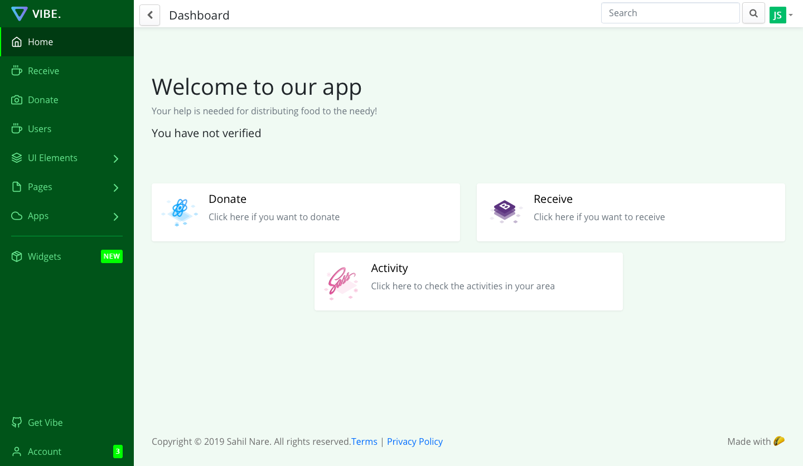
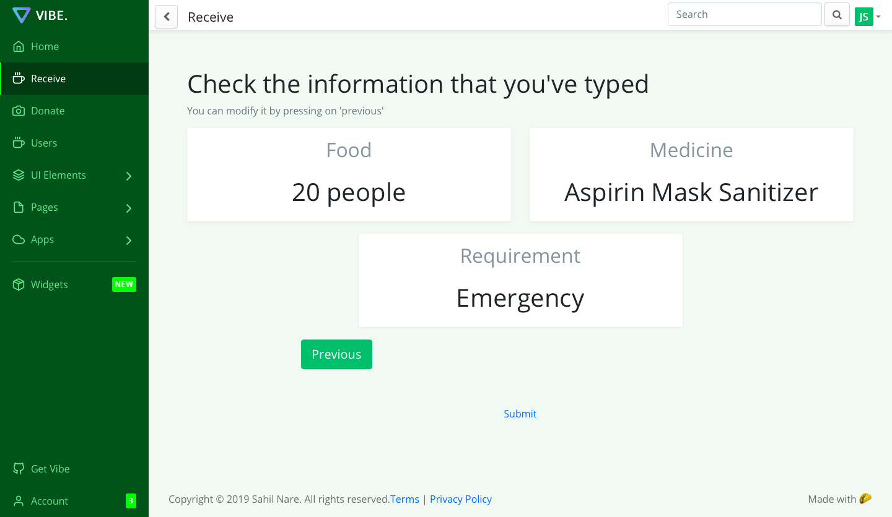
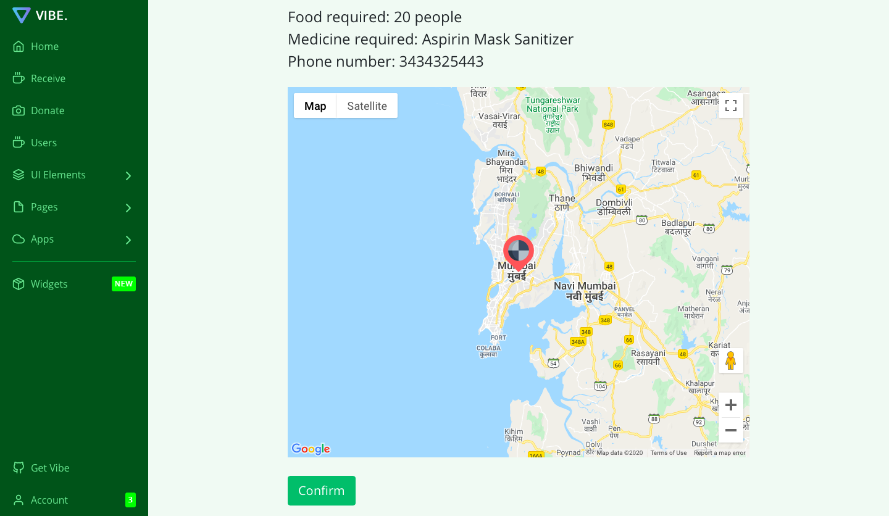
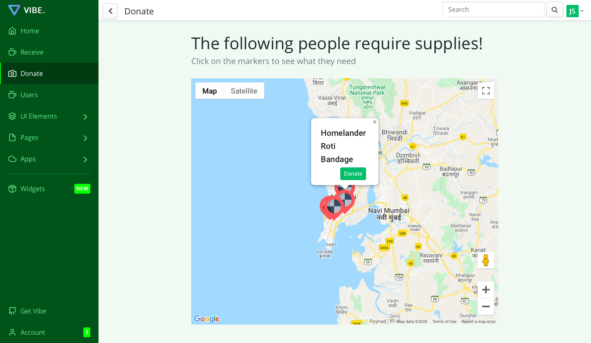
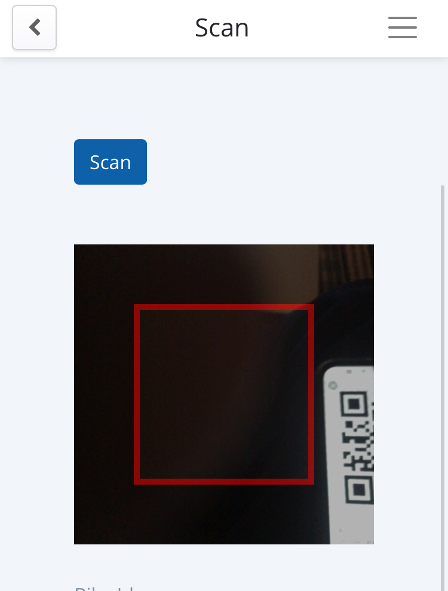

# Fight-It
## A race against virus

### The problem Fight-It solves
As there is shortage of many things like masks, medicines and food. Our web application helps in making requests for required items by hospitals/NGO. Donors can see their requests and can parcel required things to the needed hospital/NGO.  Quarantine is must nowadays but people are coming outside to buy their daily usage things like milk, etc. So we also included a feature in which a QR code is generated and a person can scan QR code of other person. It is like a virtual handshake which results in formation of a chain. If any person gets infected then alert can be send to other people to quarantine themselves.

### Usage
#### $ npm install
#### $ npm start run

[Demo Video](https://www.youtube.com/watch?v=xY4VDJLcsSM)

[Live Demo](http://covidhelperindia.herokuapp.com)

